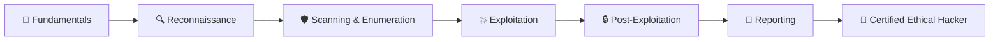

<div align="center">

# 🔐 Cybersecurity Student Journey 🎓

### *From Beginner to Ethical Hacker - A Comprehensive Learning Portfolio*

[](https://github.com/ROHITHD300900)
[](https://github.com/ROHITHD300900)
[](https://github.com/ROHITHD300900)
[](https://linkedin.com/in/rohithd300900)

</div>

---

## 👋 About This Repository

Welcome to my **Cybersecurity Student Journey**! This repository serves as a comprehensive documentation of my path toward becoming a certified ethical hacker. Here you'll find:

- 📚 **Learning resources** and study notes
- 🛡️ **Security tools** and Python scripts
- 🎯 **CTF writeups** and challenges
- 💡 **Lab exercises** and practical demonstrations
- 📈 **Progress tracking** and milestones

---

## 💻 Tech Stack & Tools

<div align="center">

### Programming & Scripting


### Security Tools


### Platforms & Labs


</div>

---

## 🎯 Learning Path



### Current Progress Tracker

| Domain | Status | Progress | Notes |
|--------|--------|----------|-------|
| 📚 Networking Fundamentals | ✅ Completed | ██████████ 100% | TCP/IP, OSI Model, Protocols |
| 🔒 Cryptography Basics | 🟡 In Progress | ███████░░░ 70% | Encryption, Hashing, PKI |
| 🔍 Reconnaissance | 🟡 In Progress | ██████░░░░ 60% | OSINT, Footprinting |
| 🛡️ Vulnerability Assessment | 🟠 Started | ████░░░░░░ 40% | Scanning, Enumeration |
| 💥 Exploitation Techniques | 🔴 Pending | ░░░░░░░░░░ 0% | Coming Soon |
| 🔧 Web Application Security | 🟠 Started | ███░░░░░░░ 30% | OWASP Top 10 |
| 🐍 Python for Security | 🟡 In Progress | ████████░░ 80% | Automation Scripts |
| 📝 Report Writing | 🟠 Started | █████░░░░░ 50% | Documentation |

---

## 🛡️ Repository Structure

```
Cybersecurity-Student-Journey/
│
├── 📚 Study-Notes/
│   ├── Networking/
│   ├── Cryptography/
│   ├── Web-Security/
│   └── Operating-Systems/
│
├── 🐍 Python-Security-Tools/
│   ├── Port-Scanner/
│   ├── Password-Cracker/
│   ├── Network-Sniffer/
│   └── Vulnerability-Scanner/
│
├── 🎯 CTF-Writeups/
│   ├── TryHackMe/
│   ├── HackTheBox/
│   └── PortSwigger-Academy/
│
├── 🧪 Lab-Exercises/
│   ├── Network-Analysis/
│   ├── Penetration-Testing/
│   └── Incident-Response/
│
└── 📜 Certifications/
    ├── CEH-Prep/
    └── Study-Plans/
```

---

## 🔥 Featured Projects

### 1. 🔍 Multi-Port Scanner
**Description:** Advanced port scanner built with Python using socket programming and multi-threading  
**Status:** 🟢 Completed  
**Skills:** Python, Networking, Sockets, Threading

### 2. 🔒 Password Strength Analyzer
**Description:** Tool to analyze password entropy and provide security recommendations  
**Status:** 🟡 In Progress  
**Skills:** Python, Regex, Security Best Practices

### 3. 🔬 Network Packet Analyzer
**Description:** Custom packet sniffer using Scapy for network traffic analysis  
**Status:** 🟠 Planning  
**Skills:** Python, Scapy, Network Protocols

---

## 🎖️ Certifications & Achievements

- 🟡 **EC-Council CEH** (In Progress - Target: Q2 2025)
- ✅ **EC-Council Python for Beginners** (Completed)
- 🎯 **TryHackMe:** Actively solving challenges
- 🛡️ **PortSwigger Academy:** Web Security Learning

---

## 📚 Learning Resources

### Books I'm Reading
- 📕 "The Web Application Hacker's Handbook" by Dafydd Stuttard
- 📗 "Hacking: The Art of Exploitation" by Jon Erickson
- 📘 "Black Hat Python" by Justin Seitz

### Online Platforms
- 🎮 [TryHackMe](https://tryhackme.com)
- 🎯 [HackTheBox](https://hackthebox.com)
- 🔥 [PortSwigger Web Security Academy](https://portswigger.net/web-security)
- 🐞 [OverTheWire Wargames](https://overthewire.org)

---

## 🚀 Current Focus Areas

```python
current_focus = {
    "certification": "CEH (Certified Ethical Hacker)",
    "programming": "Python Security Automation",
    "practice": ["TryHackMe", "HackTheBox", "CTF Competitions"],
    "study_topics": ["Web Application Security", "Network Penetration Testing", "OWASP Top 10"],
    "goal": "Build practical skills through hands-on labs and real-world scenarios"
}
```

---

## 💬 Connect With Me

<div align="center">

[](https://linkedin.com/in/rohithd300900)
[](https://github.com/ROHITHD300900)
[](https://instagram.com)
[](mailto:rohithd300900@gmail.com)

</div>

---

## 🔒 Ethical Hacking Pledge

> *"I pledge to use my cybersecurity knowledge and skills ethically and responsibly. I will respect privacy, follow legal boundaries, and contribute positively to the security community. My goal is to protect, not to harm."*

---

## 📊 GitHub Stats

<div align="center">


</div>

---

## ⭐ Star This Repository!

If you find this repository helpful or interesting, please consider giving it a star! It helps others discover this resource and motivates me to keep learning and sharing.

---

<div align="center">

### 📝 *"The only way to learn hacking is to hack!"*

**Made with ❤️ by Rohith D**

*Last Updated: November 2025*

</div>
